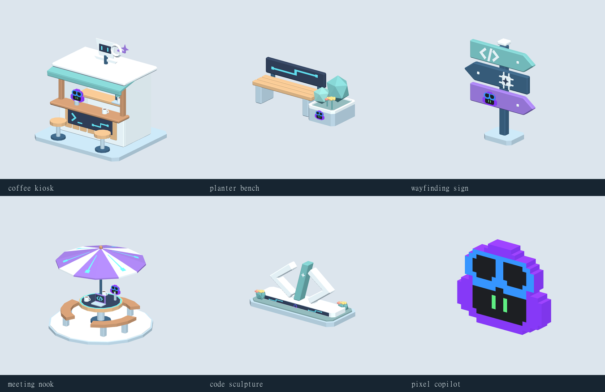

# Campus decorative collection

Five Tech / AI / Copilot-themed static props plus one reusable pixel Copilot, delivered as editable Blender sources and self-contained GLBs. All passed guarded validation and visual review in the shared Inspector, including reverse and phone-scale views. Artistic acceptance remains with the user.

| Asset / inspector | Blender source | Runtime GLB | Triangles |
| --- | --- | --- | ---: |
| [Campus coffee kiosk](http://127.0.0.1:4174/?asset=campus_coffee_kiosk&version=v01) | [Source](../../blender/environment/campus_coffee_kiosk/v01/campus_coffee_kiosk_v01.blend) | [GLB](../../assets/runtime/environment/campus_coffee_kiosk_v01.glb) | 2594 |
| [Campus planter bench](http://127.0.0.1:4174/?asset=campus_planter_bench&version=v01) | [Source](../../blender/environment/campus_planter_bench/v01/campus_planter_bench_v01.blend) | [GLB](../../assets/runtime/environment/campus_planter_bench_v01.glb) | 1178 |
| [Campus wayfinding sign](http://127.0.0.1:4174/?asset=campus_wayfinding_sign&version=v01) | [Source](../../blender/environment/campus_wayfinding_sign/v01/campus_wayfinding_sign_v01.blend) | [GLB](../../assets/runtime/environment/campus_wayfinding_sign_v01.glb) | 914 |
| [Campus outdoor meeting nook](http://127.0.0.1:4174/?asset=campus_meeting_nook&version=v01) | [Source](../../blender/environment/campus_meeting_nook/v01/campus_meeting_nook_v01.blend) | [GLB](../../assets/runtime/environment/campus_meeting_nook_v01.glb) | 2078 |
| [Campus code sculpture](http://127.0.0.1:4174/?asset=campus_code_sculpture&version=v01) | [Source](../../blender/environment/campus_code_sculpture/v01/campus_code_sculpture_v01.blend) | [GLB](../../assets/runtime/environment/campus_code_sculpture_v01.glb) | 1518 |
| [Campus pixel Copilot](http://127.0.0.1:4174/?asset=campus_pixel_copilot&version=v01) | [Source](../../blender/environment/campus_pixel_copilot/v01/campus_pixel_copilot_v01.blend) | [GLB](../../assets/runtime/environment/campus_pixel_copilot_v01.glb) | 278 |

Each asset uses one mesh, one matte opaque material and one packed texture palette with named Inspector-editable swatches: 16×4 for the standalone pixel Copilot, 128×4 for each decorated prop. Sources retain editable mesh islands. Small flowers, mugs and the laptop are secondary close-view details. These are scenery assets, ready for placement; no map placements or gameplay code were added.

Production followed the game-asset-workflow: versioned manifests, palette textures, guarded exports, actual runtime visual inspection and source/export hash records. Decisions and review evidence live beside each source.

## Tech / AI / Copilot refinement

- **coffee kiosk:** Copilot barista on the counter, terminal-style order panel, and AI-eyed cup sign with sparkle.
- **planter bench:** Smart bench backrest with cyan circuit inlay and a Copilot badge on the planter.
- **wayfinding sign:** Directional blades show code, an AI chip/sparkle, and Copilot goggles and face.
- **meeting nook:** Purple circuit canopy, cyan-rim touch table, open code laptop and an offset Copilot collaboration console.
- **code sculpture:** Preserved </> silhouette with an AI sparkle and a tech plinth carrying circuit inlays and a small Copilot badge.

The supplied original pixel Copilot now replaces the approximate badges: stepped purple head, blue goggles, dark face and green eyes. Its four exact palette roles are editable in the Inspector. Prior revisions were retained as guarded milestones. All final deliveries passed; the sculpture’s initial over-budget candidate was rejected and replaced by a simplified passing design. Props remain static; animated screens and gameplay interaction are not included.

## Dedicated pixel Copilot and reuse

The small static emblem measures 0.60 × 0.50 × 0.09 m at authored scale, with 278 triangles and no rig or animation. It is a closed, shallow extrusion of the user's original pixel design; the source reference is retained beside its Blender file.

All five decorations append the same canonical `pixel_copilot` mesh from its delivered Blender source, scale it uniformly and remap the four unchanged swatches into their own palette. Their GLBs are self-contained. Source hashes are checked before reuse, and component asset/version/hash plus placement/scale are recorded in the consumer Blender mesh metadata. Re-export the canonical source and rebuild the consumers to propagate future changes; there is no live runtime link.

Guarded validation passed for all six deliveries, and exported front/side/iso/rear/detail/phone views were personally inspected. Tiny badges intentionally remain secondary silhouette/color cues at game scale. See [multi-view review board](review-board.png) and per-asset `validation/visual_review.json` records. No gameplay code or map placement was changed.
