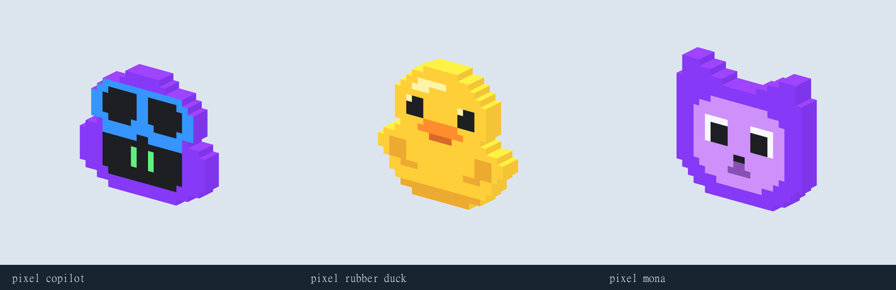

# Pixel character family

Rubber Duck and Mona are small reusable static emblems in the existing pixel Copilot style. New models are 0.55 m wide x 0.50 m tall x 0.09 m deep; uniformly scale them for badges or tabletop props. Each is a single closed mesh with one matte material and a packed 32 x 4 palette. No animation or gameplay behavior.

| Model | Inspector | Blender | GLB | Triangles |
| --- | --- | --- | --- | ---: |
| Campus pixel Rubber Duck | [View](http://127.0.0.1:4174/?asset=campus_pixel_rubber_duck&version=v01) | [Source](../../blender/environment/campus_pixel_rubber_duck/v01/campus_pixel_rubber_duck_v01.blend) | [Runtime](../../assets/runtime/environment/campus_pixel_rubber_duck_v01.glb) | 330 |
| Campus pixel Mona | [View](http://127.0.0.1:4174/?asset=campus_pixel_mona&version=v01) | [Source](../../blender/environment/campus_pixel_mona/v01/campus_pixel_mona_v01.blend) | [Runtime](../../assets/runtime/environment/campus_pixel_mona_v01.glb) | 260 |

The game-asset workflow preserves reference identity, versioned sources, semantic texture palettes, guarded delivery and hash-bound visual evidence. Both new assets passed their runtime validation without warnings; the shared Inspector review completed with no page errors. Front, side, iso, rear, close-front and phone views were personally inspected. Artistic acceptance remains with the user.

Full-catalog path checking reached these passing entries, then encountered an unrelated unfinished campus_tile_park draft missing its Blender source. No unrelated asset was changed to address that draft.

To reuse, append pixel_rubber_duck or pixel_mona from its canonical Blender file. Both expose component_asset metadata and PaletteUV. Recolor through the manifest's semantic roles and packed source palette; export after edits. Existing Copilot placements and the original tower models were left unchanged.

