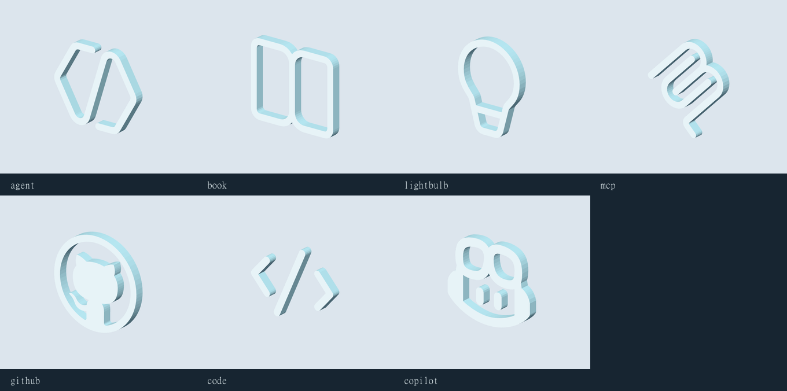

# Codicons — reusable 3D emblems

Seven source-faithful vector extrusions: proportional 0.60 m maximum width/height, 0.06 m depth, front +Z and grounded origin. Each is one mesh, one matte material, a packed 8 x 4 palette and no animation. The Inspector exposes separate icon_face and icon_edge colors. These are standalone reusable assets; existing decoration placements are unchanged.

| Asset | Inspector | Blender source | Runtime GLB | Triangles |
| --- | --- | --- | --- | ---: |
| Codicon Agent | [View](http://127.0.0.1:4174/?asset=codicon_agent&version=v01) | [Source](../../blender/environment/codicon_agent/v01/codicon_agent_v01.blend) | [GLB](../../assets/runtime/environment/codicon_agent_v01.glb) | 372 |
| Codicon Book | [View](http://127.0.0.1:4174/?asset=codicon_book&version=v01) | [Source](../../blender/environment/codicon_book/v01/codicon_book_v01.blend) | [GLB](../../assets/runtime/environment/codicon_book_v01.glb) | 444 |
| Codicon Lightbulb | [View](http://127.0.0.1:4174/?asset=codicon_lightbulb&version=v01) | [Source](../../blender/environment/codicon_lightbulb/v01/codicon_lightbulb_v01.blend) | [GLB](../../assets/runtime/environment/codicon_lightbulb_v01.glb) | 528 |
| Codicon MCP | [View](http://127.0.0.1:4174/?asset=codicon_mcp&version=v01) | [Source](../../blender/environment/codicon_mcp/v01/codicon_mcp_v01.blend) | [GLB](../../assets/runtime/environment/codicon_mcp_v01.glb) | 688 |
| Codicon GitHub | [View](http://127.0.0.1:4174/?asset=codicon_github&version=v01) | [Source](../../blender/environment/codicon_github/v01/codicon_github_v01.blend) | [GLB](../../assets/runtime/environment/codicon_github_v01.glb) | 1080 |
| Codicon Code | [View](http://127.0.0.1:4174/?asset=codicon_code&version=v01) | [Source](../../blender/environment/codicon_code/v01/codicon_code_v01.blend) | [GLB](../../assets/runtime/environment/codicon_code_v01.glb) | 252 |
| Codicon Copilot | [View](http://127.0.0.1:4174/?asset=codicon_copilot&version=v01) | [Source](../../blender/environment/codicon_copilot/v01/codicon_copilot_v01.blend) | [GLB](../../assets/runtime/environment/codicon_copilot_v01.glb) | 900 |

## Reuse and limitations

Append the codicon_<name> mesh from its canonical Blender file, scale uniformly and place against a sign, console or decorative host. Some SVGs deliberately contain detached elements (code brackets, MCP strokes, Copilot eyes). They remain separate closed islands in one mesh, not a physically connected printable assembly. No backing plaque, stand or connectors were added. Front/back faces are flat; curve edges are lightly faceted to keep budgets low.

## Provenance

Adapted from [Microsoft and contributors, vscode-codicons](https://github.com/microsoft/vscode-codicons/tree/6833ea2bc5fc49220e261a4a0fd1986ea02d1d0c), artwork licensed under [CC-BY-4.0](https://creativecommons.org/licenses/by/4.0/). Original SVGs and upstream license retained; [attribution and modification record](../../assets/third_party/microsoft/vscode-codicons/6833ea2bc5fc49220e261a4a0fd1986ea02d1d0c/ATTRIBUTION.md). Retain attribution when distributing the models. No trademark rights or endorsement implied.

The shared game-asset workflow supplied versioned registration, preserved references, tiny editable palettes, guarded exports and hash-bound visual review. All seven passed runtime validation without warnings and shared Inspector loading without page errors. Manifoldness and triangulated contour area were checked; original outlines/cutouts compared visually in front, side, iso, rear, detail and phone evidence. [Original SVG reference board](svg-reference-board.png) · [Multi-view review board](review-board.png). User artistic acceptance remains pending.

## Editing

Each version keeps build.py and geometry.json. The shared tools/asset-recipes/codicon-geometry.mjs parses only the SVG commands present in these pinned inputs, samples curves within 0.025 SVG units and verifies contour nesting and triangulated area. It is not a general SVG importer. tools/asset-recipes/codicon-extrusion.py creates the editable Blender source. Use ordinary guarded export for manual .blend edits; use --build only while the recorded procedural source hash matches. Updating raw SVG geometry is a deliberate preprocessing step, not an automatic upstream fetch.

