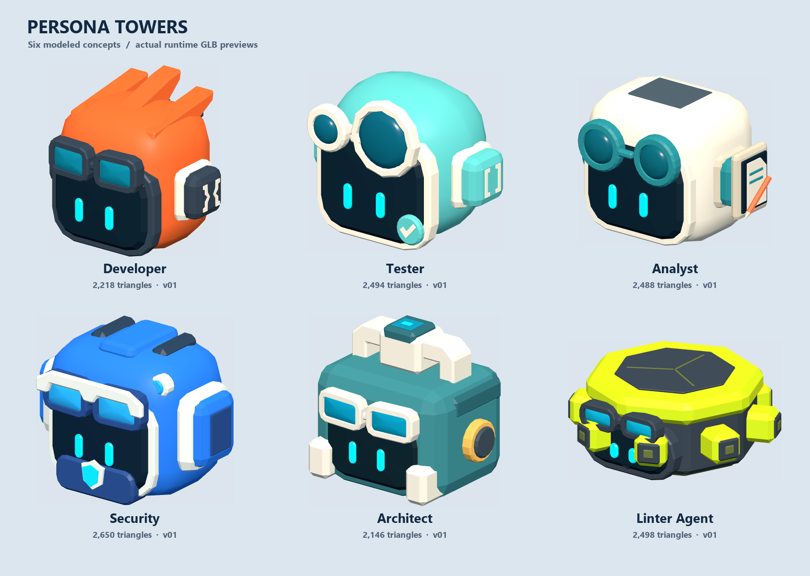

# Persona tower models

Selected concepts modeled as static, textured assets. Base Copilot is unchanged. All models use the existing compact family scale, face +Z, have grounded rest geometry and include named anchors. Animation and gameplay integration are not part of this modeling delivery.

| Model | Preview | Editable source | Runtime | Triangles |
| --- | --- | --- | --- | ---: |
| Analyst | [Inspector](http://127.0.0.1:4174/?asset=copilot_analyst&version=v01) | [Blender](C:/Users/jonas/Documents/ChatGPT/Tower/blender/towers/copilot_analyst/v01/copilot_analyst_v01.blend) | [GLB](C:/Users/jonas/Documents/ChatGPT/Tower/assets/runtime/towers/copilot_analyst_v01.glb) | 2488 |
| Security | [Inspector](http://127.0.0.1:4174/?asset=copilot_security&version=v01) | [Blender](C:/Users/jonas/Documents/ChatGPT/Tower/blender/towers/copilot_security/v01/copilot_security_v01.blend) | [GLB](C:/Users/jonas/Documents/ChatGPT/Tower/assets/runtime/towers/copilot_security_v01.glb) | 2650 |
| Architect | [Inspector](http://127.0.0.1:4174/?asset=copilot_architect&version=v01) | [Blender](C:/Users/jonas/Documents/ChatGPT/Tower/blender/towers/copilot_architect/v01/copilot_architect_v01.blend) | [GLB](C:/Users/jonas/Documents/ChatGPT/Tower/assets/runtime/towers/copilot_architect_v01.glb) | 2146 |
| Linter Agent | [Inspector](http://127.0.0.1:4174/?asset=linter_agent&version=v01) | [Blender](C:/Users/jonas/Documents/ChatGPT/Tower/blender/towers/linter_agent/v01/linter_agent_v01.blend) | [GLB](C:/Users/jonas/Documents/ChatGPT/Tower/assets/runtime/towers/linter_agent_v01.glb) | 2498 |

Sources retain named component vertex groups and packed semantic palettes. Use ordinary guarded export after manual edits; use `--build` only while the recorded source hash still matches. Each asset has its own recipe, reference copy, manifest and decision record.

Shared geometry code: [persona_geometry.py](persona_geometry.py). Construction evidence: [fixed views](construction_review_final.png), [Inspector views](inspector_review_final.png).
