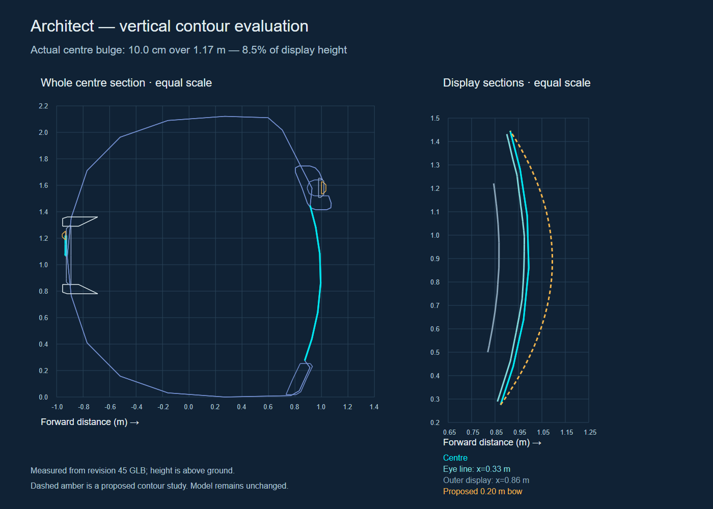

# Architect vertical face contour evaluation

Finding: the user is right that the faceplate reads too flat vertically. Revision 45 contains genuine curvature, but its visible front is too shallow and the surrounding masses reinforce a plate-like appearance. The previous author assessment of reference fidelity was too generous.

Measured from actual GLB triangle intersections at x=0, x=0.33 m (eye line) and x=0.86 m (outer display). Measurements use metres, glTF +Z forward and +Y height, without perspective or per-axis scaling. Display bulge means maximum forward departure from the straight line joining its top and bottom. Rear marks using the same dark swatch are excluded from display measurements.

| Section | Display height | Vertical bow | Bow / height |
|---|---:|---:|---:|
| Centre | 1.170 m | 0.100 m | 8.5% |
| Eye line | 1.142 m | 0.093 m | 8.1% |
| Outer display | 0.721 m | 0.035 m | 4.9% |

The centre front around eye height barely changes depth. The crown is mainly a continuation of the large rear shell; the forehead bridge reads as an applied bar. The chin is small and the lower border offers insufficient roll-under. The head has over two metres of total depth, but most of it lies behind the display and does not make the front look sculpted.

The approved concept shows fuller crown, cheek and chin volumes and a stronger curved transition into the face. Its highlights and perspective are illustrative: they cannot establish an exact depth target. The next study should give crown, display and jaw their own controlled vertical profiles, initially test a 0.18–0.22 m display bow, roll the lower frame backward, then reseat bridge and eyes. The amber curve in the diagram is a 0.20 m proposed study, not a measured concept contour or a model edit.

[Measurements](measurements.json) · [Vector chart](vertical-contours.svg) · [Current exact profile](../close-left.png) · [Approved concept](../../references/boundary_bridge_spec_pack_2026-09-30/approved-concept.png)

Canonical Blender and GLB files remain unchanged. Export SHA-256: af00b5f37467f8ed654607f80c74402534cdf6a77b8ee95aa5313dc90d690b01.
