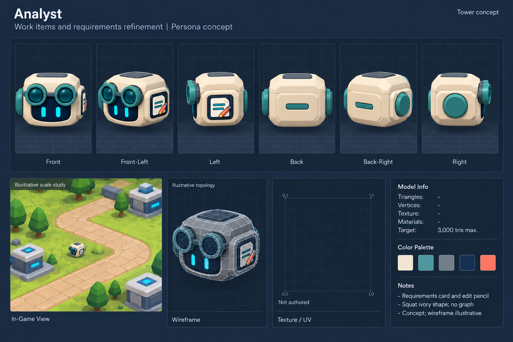

# Analyst — detailed specification

**Status:** Persona design proposal based on the latest front and rear concept sheets. Turnarounds are illustrative; production geometry is not yet authored. The scale-study scene and wireframe are illustrative in every sheet. These sheets do not certify topology, exact orthographic projection or in-game placement scale.

## Purpose and accepted gameplay baseline

Fully passive support Persona. Visual identity emphasizes turning requirements into clear Work opportunities and useful briefings.

| Property | Initial playtest design |
| --- | --- |
| Base + Persona | 30 + 30 = 60 Compute |
| Support range | 8 map units, always 360-degree Area |
| Direct action | None |
| Damage / Work per action | None / None |
| Clear Briefing | +20% Developer action speed |
| Footprint radius | 0.4 logical map units |

Clear Briefing gives in-range Developers +20% action speed for Work and damage, strongest bonus only. Opportunity Discovery generates one ordinary Work item at the Work-route entrance when an Unclear Requirements Enemy dies inside Analyst coverage; multiple Analysts do not duplicate it. It does not directly reduce required Work, erase debt or complete tasks.

Gameplay values come from [Tower Base Stats](../../../../../../../docs/Tower_Base_Stats.md), accepted 2026-09-17, with implementation alignment still pending. They are not final balance. Logical map footprint is not the visual model's world-space radius; fit and presentation scaling remain an integration concern. All six Personas are permanent upgrades from a placed Base, not separate placements. Level 1 offers Base, Developer and Tester; Analyst unlocks afterward, Security later, Architect and Linter milestones remain open.

## Visual construction

1. Low broad ivory shell with level lower rim and a flat gray crown inset; no taper at top or bottom.
2. Round teal reading glasses and simple cyan eyes maintain the scholarly Copilot character.
3. Requirements card and edit pencil are one compact temple-mounted emblem; use two broad text strokes and a folded corner. No charts.
4. Back remains a lightly beveled cream service panel with one small teal horizontal vent.

Keep a floating compact head, dark face and two readable cyan eyes. Use chunky low-poly forms and broad bevels. Preserve the role's palette and proportions rather than forcing every Persona back to the purple Base. Avoid limbs, mouths, military weapons and decorative clutter. Show clean seated connections between shell, trim and independent moving parts.

## Palette and material plan

- Swatch 1: Warm ivory shell.
- Swatch 2: Muted teal glasses.
- Swatch 3: Stone-gray crown.
- Swatch 4: Navy face.
- Swatch 5: Coral pencil.

Swatches express concept color roles, not approved production hex values. Prefer a small shared or per-asset opaque palette texture and one material; a second material needs a clear visual purpose. Exact atlas dimensions and UVs remain open. Do not infer an atlas from the empty grid.

## Animation and presentation

Proposed: calm hover, slow attentive tilts and occasional blink. A modest active acknowledgment nod can accompany support presentation. Avoid attack recoil or work-completion animation: Analyst performs no direct action.

Proposed clip meanings follow the shared vocabulary: idle for ready hover, place for arrival/settle, hit for non-terminal recoil, and work for sustained direct action where applicable. Analyst instead may use active for support presentation. Clip names, durations and rig must be confirmed in the future asset manifest.

Blender owns editable shape and pose. Simulation owns position, targeting, damage, work completion, rewards and projectile outcomes. Presentation selects clips and effects. Do not bake selection rings, coverage, projectile paths or aura boundaries into the mesh. Target anchors for future authoring: root, anchor_ui, applicable anchor_action and anchor_aura for aura emitters. These are a planning direction, not an already-created interface for the Personas.

## Technical data and authoring targets

| Field | Verified value or status |
| --- | --- |
| Triangles / vertices | - / - |
| Meshes / materials / textures | - / - / - |
| UV layout / texture dimensions | - / - |
| Dimensions / rig / final anchors | - / - / - |
| Production status | Concept imagery; no Persona mesh has been authored in this task |
| Modeling ceiling for this brief | 3,000 triangles |
| Target platform | Browser / mobile; elevated isometric view |
| Preferred material envelope | 1 material, up to 2 when justified |

The shared art guide describes a 1,000-3,000 triangle envelope for Copilot Towers. This brief uses its upper bound as the concept-authoring ceiling. For unbuilt Personas this is a proposal to carry into their future versioned manifests, not a measured count. Do not claim a triangle count from the illustrative wireframe.

## Review checklist before model delivery

- Keep the same shell depth, accessory count, symbol location and lens proportions across all views.
- Resolve side-specific attachments in one authoritative 3D model; generated turnarounds are construction guidance, not geometry truth.
- Check silhouette at phone/game scale and distinguish it without relying on color alone.
- Use continuous geometry for continuous shell regions; intentional seams for trims; explicit sockets and pivots for articulation.
- Keep symbols legible, avoid bevel intersections and ensure eyes stay within the face display through motion.
- Validate actual mesh, textures, UVs, dimensions, rig, root/anchors and named clips through the shared guarded asset pipeline when a model is authored.
- Review fixed front/side/rear, oblique joins, motion extremes and gameplay-scale readability in the Asset Inspector before production delivery.

## Provenance and constraints

- Latest front concept: ../copilot_persona_concepts_v04.png.
- Rear continuation: ../copilot_persona_rear_three_quarter_v01.png; Persona backs remain exploratory.
- User direction: vary Persona colors, goggles and bulk. Analyst must avoid the rejected banana-like taper and graph motif; use work-item/requirements-refinement symbolism.
- Base authority: ../../../copilot_base_v02.blend and ../../../asset.json. The source and runtime have not been changed for these sheets.
- Generated with the built-in image generation tool using the model-spec-sheet template; prompt saved in prompts/analyst.txt.

