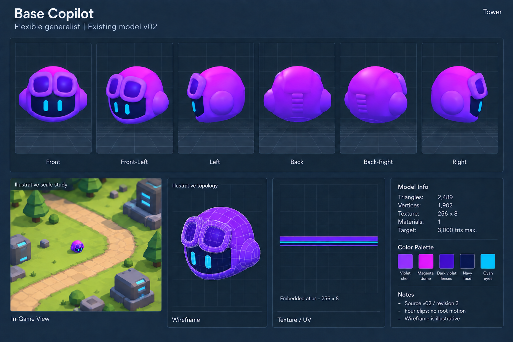

# Base Copilot — detailed specification

**Status:** Existing Base model with verified runtime statistics; sheet imagery is an image-generated reconstruction. The scale-study scene and wireframe are illustrative in every sheet. These sheets do not certify topology, exact orthographic projection or in-game placement scale.

## Purpose and accepted gameplay baseline

Affordable starting Tower that completes productive Work and damages Enemies. Upgrades permanently into a Persona.

| Property | Initial playtest design |
| --- | --- |
| Placement | 30 Compute |
| Persona upgrade | - |
| Range | 5 map units |
| Action interval | 0.5 s |
| Damage / Work per action | 5 / 5 |
| Ideal damage / Work per second | 10 / 10 |
| Footprint radius | 0.4 logical map units |

No passive or special ability in the accepted starting definition.

Gameplay values come from [Tower Base Stats](../../../../../../../docs/Tower_Base_Stats.md), accepted 2026-09-17, with implementation alignment still pending. They are not final balance. Logical map footprint is not the visual model's world-space radius; fit and presentation scaling remain an integration concern. All six Personas are permanent upgrades from a placed Base, not separate placements. Level 1 offers Base, Developer and Tester; Analyst unlocks afterward, Security later, Architect and Linter milestones remain open.

## Visual construction

1. Rounded purple shell, goggle frames, inset lenses, ear pods and dark face remain rigidly attached to the body.
2. Two cyan eye meshes provide expression by scaling; no mouth or limbs.
3. Rear vent ribs and lower shell lip match the actual source.

Keep a floating compact head, dark face and two readable cyan eyes. Use chunky low-poly forms and broad bevels. Preserve the role's palette and proportions rather than forcing every Persona back to the purple Base. Avoid limbs, mouths, military weapons and decorative clutter. Show clean seated connections between shell, trim and independent moving parts.

## Palette and material plan

- Swatch 1: Violet shell.
- Swatch 2: Magenta dome.
- Swatch 3: Dark violet lenses.
- Swatch 4: Navy face.
- Swatch 5: Cyan eyes.

The original embedded image and material are retained. See support/base_texture_0.png for the actual image bytes and support/base_verified_stats.json for measured data. The palette strip drawn inside the PNG sheet is a visual reconstruction; use the extracted image or Blender source for production.

## Animation and presentation

Existing clips: idle 2.5 s loop with gentle hover and blink; work 1.5 s focused nod; place 1.25 s settle; hit 0.75 s recoil. Nominal visual lift 0.18 m; stationary root.

The existing source owns its four named clips and three-bone rig.

Blender owns editable shape and pose. Simulation owns position, targeting, damage, work completion, rewards and projectile outcomes. Presentation selects clips and effects. Do not bake selection rings, coverage, projectile paths or aura boundaries into the mesh. Target anchors for future authoring: root, anchor_ui, applicable anchor_action and anchor_aura for aura emitters. These are a planning direction, not an already-created interface for the Personas.

## Technical data and authoring targets

| Field | Verified value or status |
| --- | --- |
| Triangles | 2,489 |
| Exported vertices | 1,902 POSITION records, including split render vertices |
| Meshes / materials | 2 / 1 |
| Embedded image | 256 x 8 PNG; one unique image |
| Texture bindings | Two glTF texture entries share the image for base color and emission |
| UVs | TEXCOORD_0 exists on all primitives; UV islands are not diagrammed in this sheet |
| Rig | 3 bones |
| Rest dimensions, W x H x D | 2.2728 x 1.8003 x 1.9464 metres |
| Verified source | copilot_base v02, revision 3 |
| Runtime hash | 2fd051fc4a50e490154bc0ba52ecfcaafbb637bb323ef41d4754c45e540456e0 |
| Modeling ceiling for this brief | 3,000 triangles |
| Target platform | Browser / mobile; elevated isometric view |
| Preferred material envelope | 1 material, up to 2 when justified |

The shared art guide describes a 1,000-3,000 triangle envelope for Copilot Towers. This brief uses its upper bound as the concept-authoring ceiling. For unbuilt Personas this is a proposal to carry into their future versioned manifests, not a measured count. Do not claim a triangle count from the illustrative wireframe.

## Review checklist before model delivery

- Keep the same shell depth, accessory count, symbol location and lens proportions across all views.
- Resolve side-specific attachments in one authoritative 3D model; generated turnarounds are construction guidance, not geometry truth.
- Check silhouette at phone/game scale and distinguish it without relying on color alone.
- Use continuous geometry for continuous shell regions; intentional seams for trims; explicit sockets and pivots for articulation.
- Keep symbols legible, avoid bevel intersections and ensure eyes stay within the face display through motion.
- Validate actual mesh, textures, UVs, dimensions, rig, root/anchors and named clips through the shared guarded asset pipeline when a model is authored.
- Review fixed front/side/rear, oblique joins, motion extremes and gameplay-scale readability in the Asset Inspector before production delivery.

## Provenance and constraints

- Latest front concept: ../copilot_persona_concepts_v04.png.
- Rear continuation: ../copilot_persona_rear_three_quarter_v01.png; Persona backs remain exploratory.
- User direction: vary Persona colors, goggles and bulk. Analyst must avoid the rejected banana-like taper and graph motif; use work-item/requirements-refinement symbolism.
- Base authority: ../../../copilot_base_v02.blend and ../../../asset.json. The source and runtime have not been changed for these sheets.
- Generated with the built-in image generation tool using the model-spec-sheet template; prompt saved in prompts/base_copilot.txt.

