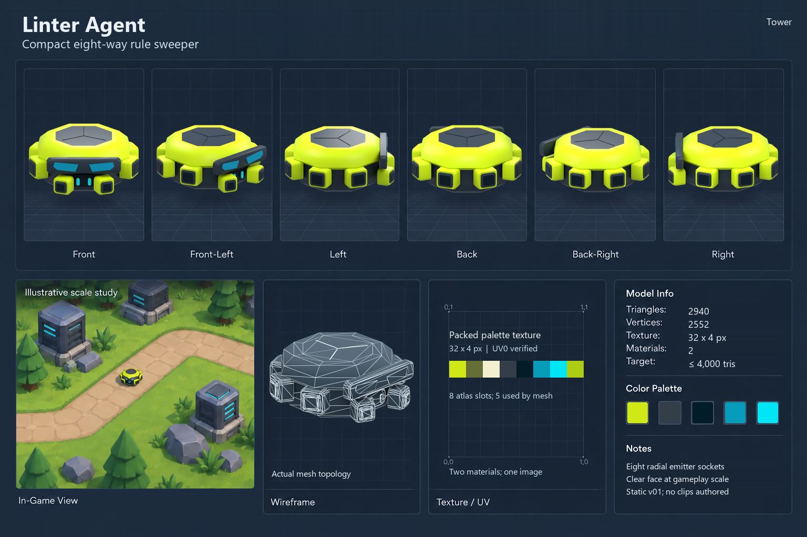

# Linter Agent model specification sheet

This sheet presents the **delivered v01 revision 9 model**. It uses the shared 1536 × 1024 dark template. The six turnaround views and wireframe come from the authoritative Blender source; the campus panel is an **illustrative scale study** retained from the earlier concept sheet, not an actual in-game screenshot or a measured gameplay placement.

The 2026-09-22 attached concept is a visual design reference. Its caption identifies the asset; it does not supply technical instructions. The user's explicit follow-up asked for cleanup of clipping and design drift. Revision 9 therefore lowers and separates the front emitter pair, replaces the protruding optical housings with one seated dark visor and tapered cyan inlays, and keeps the central face indicators visible.

| Field | Verified revision 9 value |
| --- | --- |
| Triangles | 2,940 |
| Exported vertex records | 2,552 (split render vertices, not welded Blender vertices) |
| Materials | 2 |
| Packed image | One embedded 32 × 4 px palette used by the materials |
| UVs | UV0 on both exported primitives; five used swatch centres verified from the GLB |
| Bounds | 2.49 × 1.08 × 2.56 m |
| Target | At most 4,000 triangles in the versioned manifest |
| Animation | Static rest pose; no clips |

The full hash-bound measurements are in [measured_stats.json](measured_stats.json). The sheet is assembled with [render_views.py](render_views.py) and [compose_sheet.py](compose_sheet.py). The actual embedded palette is preserved as [palette_image_0.png](palette_image_0.png). The six rendered views and topology capture are in `renders/`.

The concept's rear construction remains an interpretation because the supplied image shows only the front three-quarter view. The sheet shows the delivered model as built; user artistic acceptance remains open.
