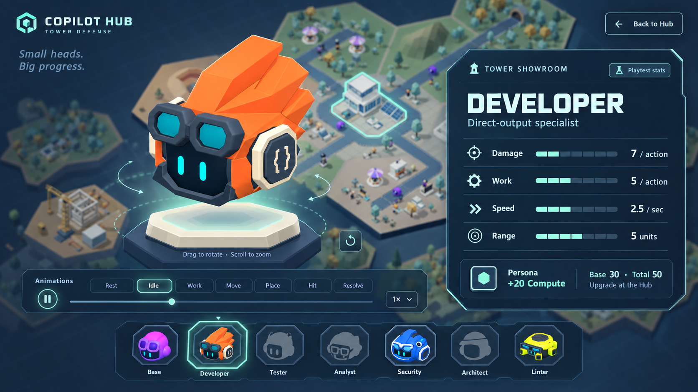
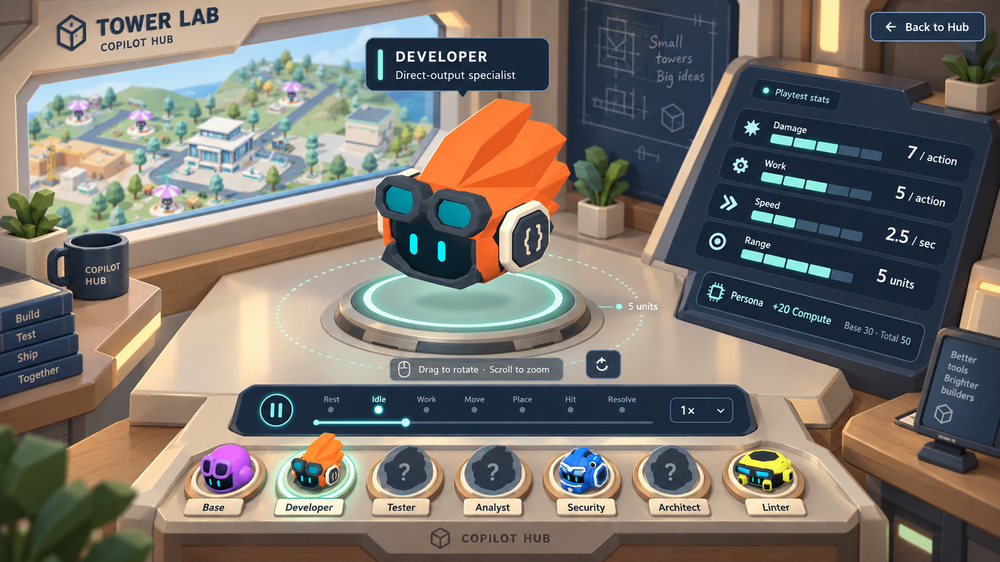
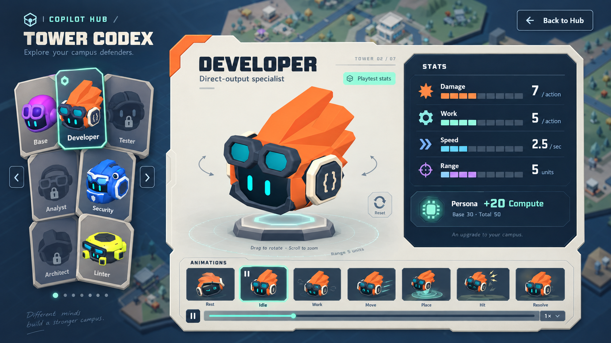

# Copilot Hub Tower inspection — interface concepts

Three AI-rendered game UI mock-ups made with the built-in image generation tool. These are visual proposals, not screenshots of implemented functionality. The current campus and canonical Tower renders provide the visual references. Generated model details and text are illustrative; the real models and documented stats remain authoritative.

## A — Tower Showroom (recommended)

A character display plinth, compact stat plate and portrait sockets, with the campus visible behind the overlay. Best starting point for a clear, distinctive game interface.

## B — Lab Workbench

A physical inspection table inside the central building. Strongest sense of visiting a place; requires a lab interior and more layout work for phones.

## C — Tower Codex

A tactile character dossier and collection deck. A more collectible, graphic direction with the model still central.

See the [interaction and functionality plan](../../../../docs/design/Copilot_Hub_Tower_Showcase.md) and [exact prompts](prompts.json). Developer values are the accepted initial playtest design, not final balance or a claim that every Persona is implemented.
