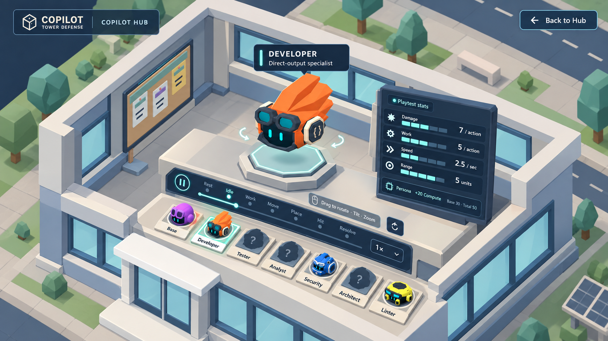
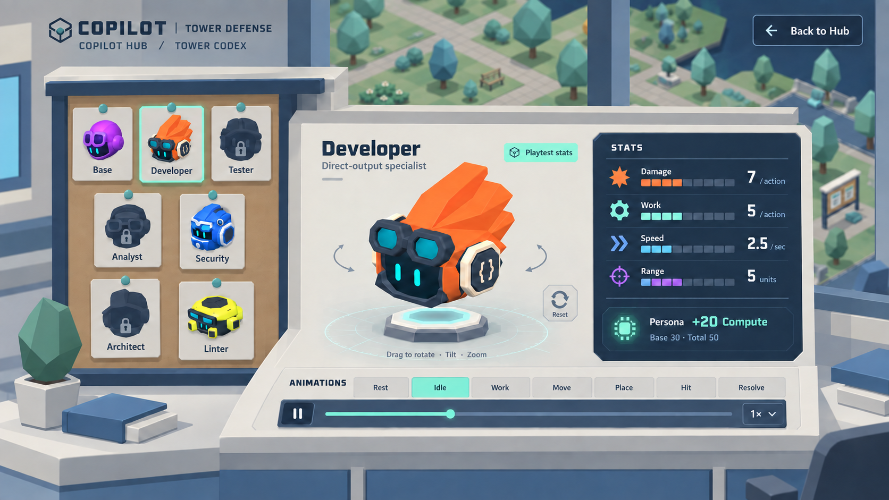

# Copilot Hub Tower inspection — refinements 2 and 3

Historical iteration: the user subsequently selected **3 — Codex** and removed numeric stat readouts and playback controls. See [the current selected refinement](../v03/README.md).

User direction: refine the Workbench and Codex so they belong to the existing assets and Hub as one world. These are revised image concepts, not implemented UI or delivered 3D assets. Earlier concepts remain in [v01](../v01/README.md).

## 2 — Hub Lab Workbench

The inspection bay is revealed inside a cutaway of the existing central Lab. The off-white slab edges, blue-gray window frames, paving, faceted trees and daylight all come from the Hub's current visual language. A plain inspection bench holds the selected Tower, an attached stats console, animation controls and a portrait selection rail.

The intended transition is a closer campus camera and a roof reveal, with the selected model shown on the bench. The cutaway/interior is proposed new art; the current Lab's exterior remains its reference. Keep the same model scale conventions and rendering style through the transition.

## 3 — Hub Tower Codex

The collection becomes a catalog station built from the existing campus noticeboard language: a thin off-white cap, blue-gray frame, muted teal tabs and simple physical portrait dossiers. The selected dossier combines the rotatable model, stats and animation strip into the same station. Views of the Hub around it keep the location clear.

The intended transition is a closer view of the Lab's catalog station, with the chosen dossier coming forward. Cards remain a collection metaphor, with simple geometry and flat colors matching the campus props.

## Shared design rules

- Match the actual Hub render: orthographic composition, neutral daylight, flat matte palette, simple shadows and restrained bevels.
- Reuse Lab slab/window details and campus noticeboard construction. New interior props should look like members of the same asset kit.
- Keep existing Tower geometry and colors authoritative. UI generation is not a character redesign.
- Use the current Hub's slim navy/mint controls and modest text hierarchy. Exact numbers and labels are accessible screen-aligned UI in the eventual implementation.
- Retain rotation, tilt, zoom/reset, seven animation choices, playback controls and visual stats from the original interaction plan.
- Model art, unavailable entries, unlock conditions and approved gameplay stats remain separate. The pictured Developer uses the accepted playtest stats.

Generated using the built-in image generation tool. Exact prompts and reference paths are in [prompts.json](prompts.json). Source references include the current Hub scene, `campus_lab`, `campus_noticeboard` and the canonical Developer render. Generated images are visual proposals; minor rendered text/model differences do not override those sources.

See the [interaction and functionality plan](../../../../docs/design/Copilot_Hub_Tower_Showcase.md).
