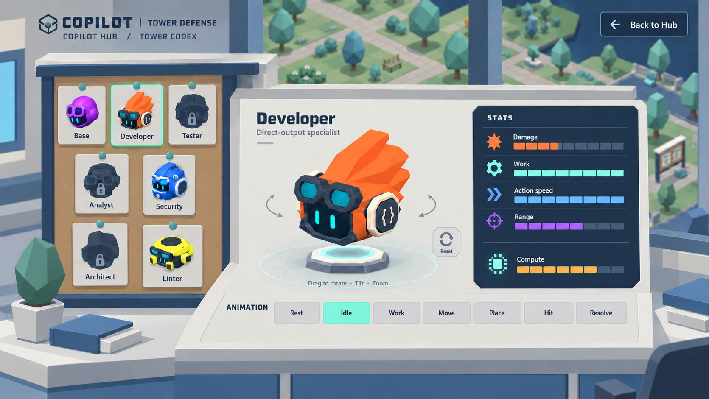

# Copilot Hub — selected Tower Codex

Historical refinement: the user found these controls too flat. See [v04](../v04/README.md) for the current tactile Hub-style treatment; the animation and non-numeric stat requirements below remain in effect.

The user selected concept 3 and requested a final refinement that looks like the real game, with animation selection only and visual stats without numbers. This image is an in-game-style mock-up; production UI has not been implemented in this pass.

## Decisions captured

- Preserve the physical catalog/noticeboard collection, central rotatable Tower and Lab setting from concept 3.
- Match the Hub's simple low-poly shapes, flat matte palette, modest bevels and neutral lighting. Keep the current Tower model identity and park continuity outside the Lab windows.
- Offer only **Rest, Idle, Work, Move, Place, Hit, Resolve** as animation choices. Selecting one plays it automatically at the authored speed. No speed control, transport buttons or timeline.
- Show **Damage, Work, Action speed, Range** as labeled visual gauges. **Compute** uses a separate visual expenditure meter. No numbers, units, percentages, price breakdown or total in the player-facing stat panel.
- Keep rotation/tilt/zoom and camera reset controls; these are distinct from animation playback controls.
- Remove development badges and decorative copy so the interface reads as a player-facing game screen.

Generated with the built-in image generation tool. See [exact prompt and references](prompts.json) and the updated [interaction plan](../../../../docs/design/Copilot_Hub_Tower_Showcase.md). Earlier iterations remain preserved in v01 and v02. Generated text and geometry are visual proposals; actual game assets and approved stat definitions remain authoritative.
