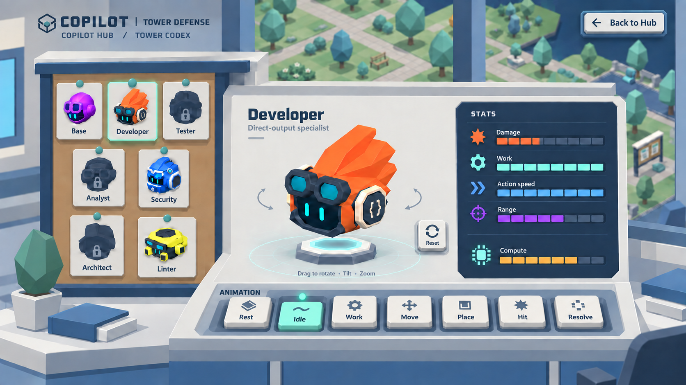

# Copilot Hub — tactile Codex controls

Historical refinement: the user subsequently requested GitHub styling. See [v05](../v05/README.md) for the current visual direction, which retains physical control depth.

The user found v03's buttons too flat and disconnected from the Hub. This refinement gives the controls physical depth using the existing Lab and campus prop palette. This is a generated game-interface mock-up, not an implemented screen.

- Animation choices become raised ivory keys with simple bevels, blue-gray sidewalls and contact shadows, seated in a recessed console rail.
- The selected Idle key sits lower, with a muted mint face and small status light. Selection remains the only animation control.
- Back to Hub and camera Reset share the same physical button construction.
- Portrait plaques and stat tracks use related edge and shadow treatments, with the existing low-poly Lab and park setting preserved.
- Stats remain entirely visual; no numerical readouts, prices or units. No animation speed controls, transport buttons or timeline.

Generated with the built-in image generation tool. See the [main prompt and references](prompts.json), [final cleanup prompt](refinement-prompt.json) and [interface plan](../../../../docs/design/Copilot_Hub_Tower_Showcase.md). The cleanup removes an unintended extra blank animation key. Previous versions remain preserved. Actual game models and approved gameplay definitions remain authoritative.
