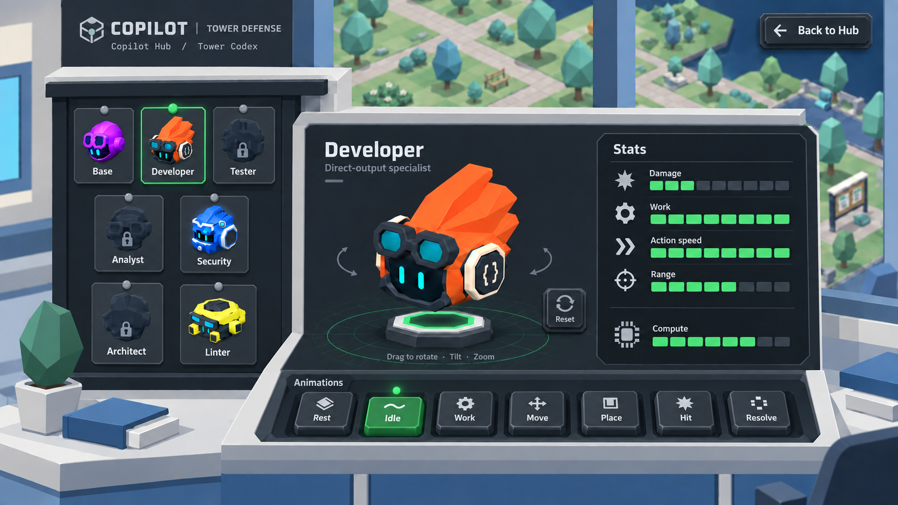

# Copilot Hub — GitHub-inspired Codex

Historical exploration: the user subsequently supplied specific Primer Brand references. See [v06](../v06/README.md) for the current proposal.

The user requested more GitHub styling. This iteration applies that influence to the selected Codex while retaining the physical controls and low-poly Hub setting. It is a generated game-interface mock-up, not an implemented screen.

- Charcoal and graphite equipment surfaces with restrained neutral borders, light text and green selection accents.
- Compact typography and simple line icons, informed by [GitHub Primer foundations](https://primer.style/product/getting-started/foundations/).
- Animation keys keep their visible depth, bevels, contact shadows and pressed selection state. Back to Hub and camera Reset share their treatment.
- The Lab shell stays ivory and blue-gray, with the bright campus visible through the windows. Canonical character colors remain intact.
- Exactly seven animation choices; no speed controls, timeline or transport controls. Stats remain labeled visual gauges without numbers, units or prices.

Generated with the built-in image generation tool. See the [exact prompt and references](prompts.json) and [interface plan](../../../../docs/design/Copilot_Hub_Tower_Showcase.md). Earlier versions remain preserved. Actual game assets and approved gameplay definitions remain authoritative.
