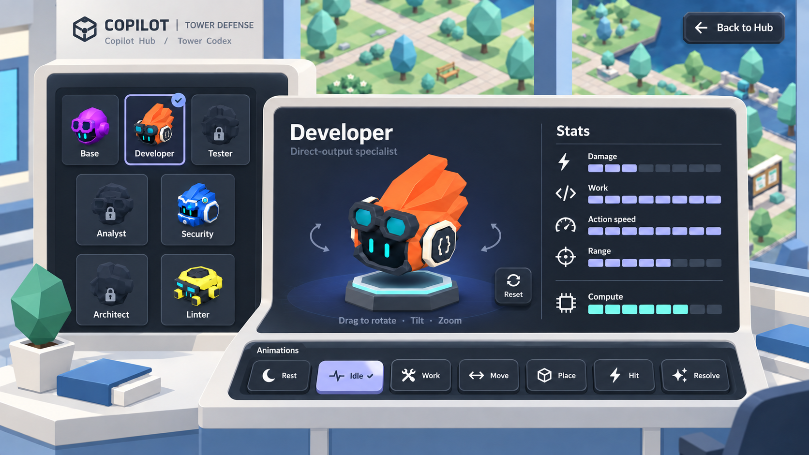

# Copilot Hub — Primer Brand refinement

The subsequent [v07 office proposal](../v07/README.md) extends this interface direction into the room's architecture and furnishings. The source observations and palette below remain applicable.

The user supplied Primer Brand, theming, Octicons and Primitives display-scale references. This proposal applies those references to the selected Codex while retaining the Hub environment and physical control depth. It is a generated mock-up, not an implemented screen.

## Direction

- Clear Mona Sans heading hierarchy, sentence-case labels, more breathing room and small leading icons.
- A light ivory Lab shell around dark equipment; indigo selection accents and muted teal signals replace the previous universal green treatment.
- Simpler low-profile controls retain a visible lower lip, highlight and contact shadow. Selected Idle sits lower and uses a light accent face with dark text.
- Exactly seven animation choices, with no speed controls, timeline or transport buttons. Stats remain entirely visual with no numbers, units or prices.
- The actual low-poly campus and canonical character palette remain the world reference.

## Reference observations and interpretation

[Primer Brand](https://primer.style/brand/) is the requested design-system reference. [Brand theming](https://primer.style/brand/introduction/theming/) provides light/dark modes; using a light room around dark equipment is our interpretation for this game. The live Brand page's heading computed style uses Mona Sans.

[Brand buttons](https://primer.style/brand/components/Button/) use a clear action hierarchy, sentence-case labels and contextual leading icons. Physical lips and contact shadows are added here to preserve the user's game-control depth requirement.

[Octicons](https://primer.style/octicons/) and their [design guidelines](https://primer.style/octicons/design-guidelines/) guide consistent icon geometry. Production should use the actual SVGs; generated icons in this image are visual approximations.

Selected values observed in the user's [Primitives display-scale Storybook](https://primer.style/primitives/storybook/?path=/story/color-base-display-scales--all-scales), under its Light preview:

| Display token | Value | Proposed use |
| --- | --- | --- |
| gray-0 | `#e8ecf2` | Light foreground |
| indigo-2 | `#b1b9fb` | Selected control face |
| indigo-4 | `#7a82f0` | Meter/selection accent |
| indigo-9 | `#25247b` | Subtle display depth |
| blue-1 | `#ade1ff` | Secondary highlight |
| teal-1 | `#89ebe1` | Quiet secondary signal |
| teal-2 | `#22d3c7` | Limited accent |

This is a chosen palette from those scales, not an official prescribed brand theme. Production should map suitable theme-aware semantic tokens to roles and check their contrast in context.

Generated with the built-in image generation tool. See the [exact prompt and references](prompts.json) and [interface plan](../../../../docs/design/Copilot_Hub_Tower_Showcase.md). Earlier versions remain preserved. Actual game assets and approved gameplay definitions remain authoritative.
