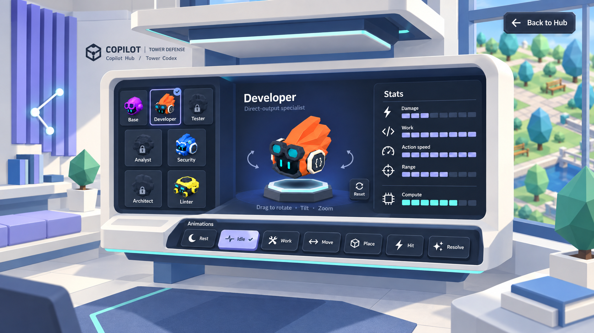

# Copilot Hub — Copilot Studio office

The subsequent [v08 environment study](../v08/README.md) imagines GitHub as an inhabitable workplace around a human-scale inspection station. This image remains the closer Codex station view.

The user requested a more creative Primer-inspired office around the selected Codex. This iteration extends the v06 interface direction into architecture and furniture. It is a generated in-game-style mock-up, not an implemented room or delivered game model.

## Architectural direction

- A broad ivory portal and indigo inner reveal give the station its own architectural alcove.
- The collection, live model, stats and animation sill become one continuous built-in station, with a light cantilevered desk and restrained teal edge lighting.
- Lavender acoustic fins, a window bench, a low-poly planter and a small shelf make the room feel like a working studio.
- A quiet branch-and-node light and geometric floor inset echo the game's software theme and digital atmosphere.
- The bright Hub remains visible through the windows; actual character proportions, colors and the low-poly rendering style remain authoritative.

The seven animation choices, physical control depth, camera inspection and purely visual stats from v06 remain in effect. No speed controls, timeline, transport controls or numerical stats are introduced.

The room design is our interpretation of the user's Primer Brand references; it is not an official architectural branding prescription. See [v06's source observations and palette](../v06/README.md).

Generated with the built-in image generation tool. See the [exact prompt and references](prompts.json) and [updated interface/environment plan](../../../../docs/design/Copilot_Hub_Tower_Showcase.md). Earlier versions remain preserved. Any production interior art is future work and should follow the project's asset workflow.
