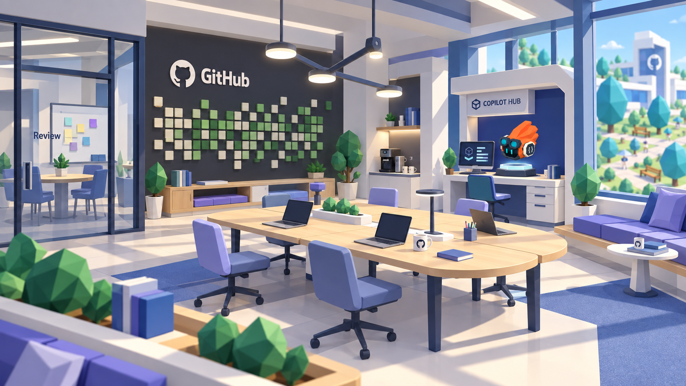

# GitHub as a physical office

The user selected this setting for the [v09 Tower browser and inspection interface](../v09/README.md).

The user asked to imagine what GitHub would look like as a real office. This companion environment concept makes the room a believable workplace within the Hub's low-poly world. It is an imagined setting, not a depiction of an existing GitHub office.

## Spatial interpretation

- Shared pale-oak worktables come together at a discussion area, suggesting branches merging through collaboration.
- A slender branching pendant and a tactile contribution-inspired acoustic wall express GitHub through the room's objects and construction.
- A glass review room, quiet window seating, coffee point and a few everyday work objects give the office a purpose beyond displaying Towers.
- Ivory architecture, charcoal frames, indigo upholstery, limited teal accents and faceted plants keep it connected to the established Hub world.
- The Codex belongs at a human-scale workbench within the room. Its orange Developer preview is a supporting detail in this environmental view.

This study explores the physical office, not a replacement interaction layout. The approved Tower inspection, animation choices and non-numeric stats remain as specified in the [interface plan](../../../../docs/design/Copilot_Hub_Tower_Showcase.md); [v07](../v07/README.md) retains the closer station view.

Generated with the built-in image generation tool. See the [exact prompt and references](prompts.json), and [v06's Primer source observations](../v06/README.md). No production UI or game models were changed in this concept pass.
