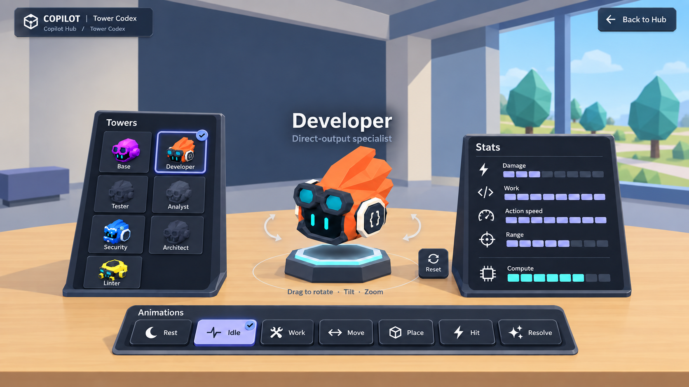

# Copilot Hub — Tower browser in the GitHub office

The user approved this final mock-up and requested a build plan with entry through the main Hub building. It combines a simplified office with the approved inspection behavior: no GitHub back-wall logo and less foreground/background decoration. This is the implementation's visual reference, not an implemented screen. See the [build plan](../../../../docs/design/Copilot_Hub_Tower_Showcase_Implementation.md).

## Player view

- **Browse:** select a portrait in the left Tower rack. The current Tower has an indigo edge and check marker; the model and stats update in place.
- **Inspect:** the large live model floats above a plinth on the shared oak worktable. Drag to rotate/tilt, zoom, or reset the camera.
- **Understand:** labeled segmented gauges show Damage, Work, Action speed, Range and Compute without numerical values, prices or units.
- **Animate:** select Rest, Idle, Work, Move, Place, Hit or Resolve. No speed controls, timeline or transport buttons.
- **Return:** Back to Hub remains visible at the upper right.

The room retains warm desk color, ivory/blue-gray architecture and a modest campus window. The cleanup removes corporate logos, contribution-wall tiles, pendant lights, dense review-room dressing and foreground plants, mug, notebook and chair. Compact controls keep their depth; the model occupies open scene space. Unknown model portraits use silhouettes, without inventing lock conditions.

Generated with the built-in image generation tool. See the [initial composition prompt](prompts.json), [final user-directed cleanup prompt](refinement-prompt.json), [office study](../v08/README.md), [Primer observations](../v06/README.md) and [updated interaction plan](../../../../docs/design/Copilot_Hub_Tower_Showcase.md). Canonical runtime models and approved gameplay definitions remain authoritative. No production UI or game assets changed in this pass.
