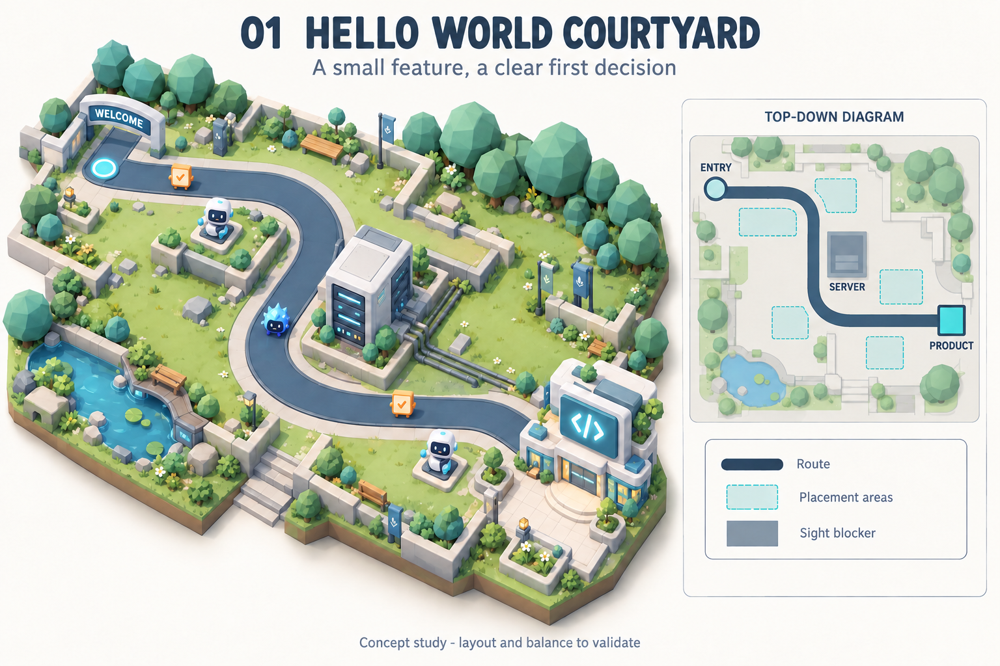
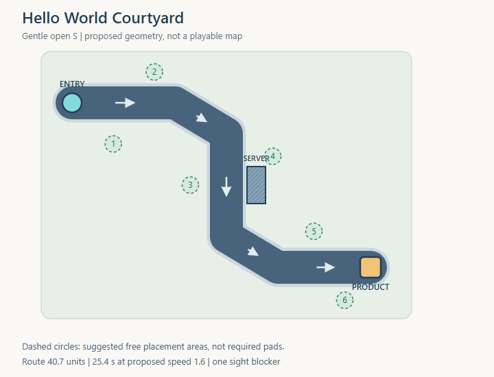
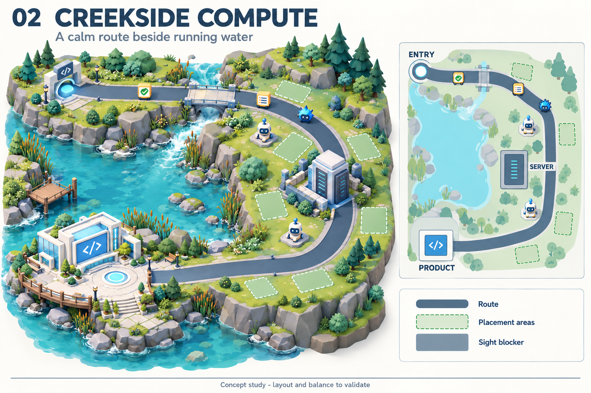
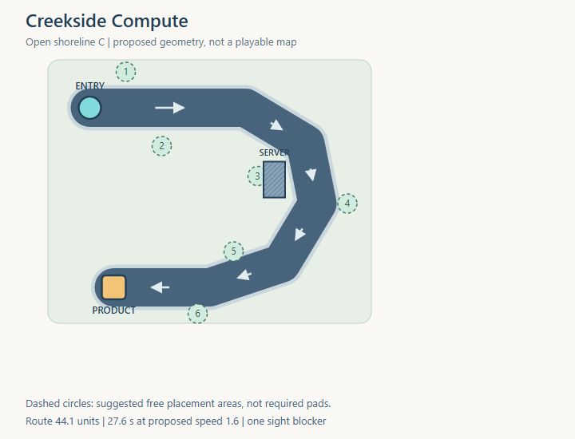
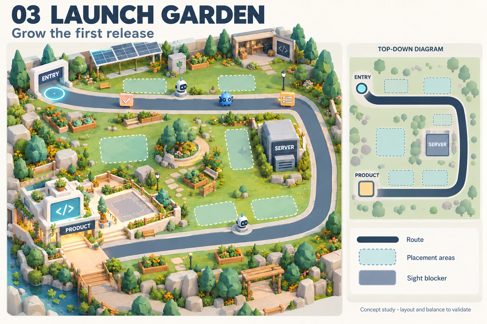
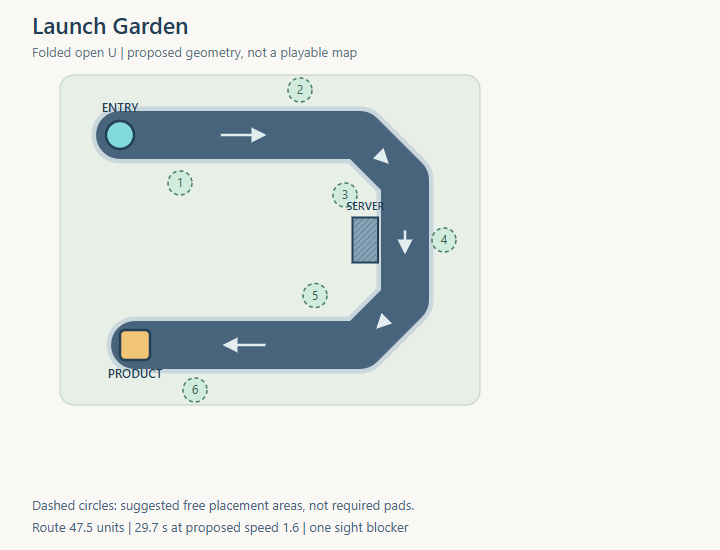

# Draft intro map concepts

These three proposals explore the first map for **Just One Small Feature**. Start with **Hello World Courtyard** as the recommended direction: its open S route separates early Work, the Server sight lesson and late recovery most clearly. Creekside Compute emphasizes landscape; Launch Garden makes placement more deliberate.

**Status: Hypothesis.** Themes, geometry, new scenery, numerical targets and tutorial ordering are proposals for discussion. They are not registered maps, implemented balance or changes to the agreed Level 1 rules. Date: 30 September 2026.

## Existing foundation

The [Level 1 brief](../Level_01_Just_One_Small_Feature.md) establishes one readable route carrying productive Work and Problems, a Server that blocks sight and prohibits placement, and Base Copilot with Developer and Tester branches. It introduces light Ambiguous Requirement, debt cleanup and a contained Production Incident. Analyst unlocks after success. Regression and Syntax Error stay outside this level.

The [visual guide](../../Visual_Asset_Guide.md) establishes a welcoming low-poly technology campus integrated with landscape, a fixed isometric camera and a clear Product destination. Reuse the campus slate and teal material family while allowing each setting its own natural colors. New assets can follow the selected theme; the current asset inventory does not constrain these concepts.

The current gameplay encounter is an engineering fixture, separate from the decorative 3D home campus. Its 20-unit route and five-second traversal at fixture speed are not an intro-level balance target. Current placement is free within valid areas, and gameplay route geometry is planar. A Creekside bridge would be visual scenery over that planar route; real elevation or bridge mechanics would require additional design and implementation.

## Player experience

The player orchestrates a small team that builds the Product while protecting it. Place and specialize Copilots, allocate local coverage through Build, Defend or Auto, and reinvest Compute from successful Work and Problem resolution.

Completed Work earns Compute, capped healing and visual Product Progress. A leaked Problem damages the Product; unfinished Work forfeits its rewards and adds debt. Better play means understanding local exposure and sight rather than stacking every tower beside the destination. A useful Tester remains active and improves nearby results; overlapping auras do not stack.

The first decision should happen during preparation. The first moving Work should demonstrate progress and a payout before mixed traffic demands prioritization. A readable Bug then establishes the defensive half of the loop. Keep retry and feedback clear when the player makes a recoverable early mistake.

## Decisions to make

| Decision | Proposed starting point | Why it matters |
| --- | --- | --- |
| Setting and story | Hello World Courtyard, a small team's first feature | Establishes the game's identity and reusable environment kit. |
| Route and travel | One route, three useful coverage stretches, roughly 23–30 seconds of unobstructed travel | Creates time to understand moving Work without stretching the map into a maze. |
| Placement | Free placement in clearly legible grass and paved areas, with six suggested regions | Preserves experimentation; the regions are guidance, not six mandatory sockets or a tower cap. |
| Server sight lesson | One visible Server beside the middle bend, with viable positions on both sides | Makes the range preview teach an understandable coverage tradeoff. |
| Opening budget | Trial 100 Compute with 30 for Base and 20 for specialization | Allows three Bases with 10 left, or two specialized Copilots with no reserve. Both openings should be viable. |
| Intro pacing | Trial 10–14 active minutes across about eight segments, plus untimed planning | A shorter onboarding candidate than the existing 3–6 minute normal-wave hypothesis; requires a pacing decision and playtest. |
| Camera and Product | Show entry, Server, final approach and Product together; reserve space for visual growth | Maintains touch readability and a clear destination. |

Resolve theme and placement style first, then map scale and pacing. Exact HP, task Work, rewards, spawn intervals and boss stats should follow the geometry test rather than being treated as settled.

## Three map concepts

All three use one shared route, one deliberate Server, three teaching stretches and the same small Level 1 roster. Artwork is a theme study. The SVG plans and JSON provide explicit proposed geometry for comparison; neither substitutes for playable validation. Robot, task, Bug and Product shapes in the generated renders are illustrative placeholders rather than approved redesigns.

### Hello World Courtyard

A gentle open S passes through a small development courtyard. Rounded trees, a tiny pond and compact utility details establish a friendly campus. The Product studio anchors the final approach, with room for a visible feature module after success.

Early positions can finish uncomplicated Work. The middle bend makes the Server's shadow visible in the coverage preview. The final straight supports recovery from earlier misses. Keep decorations low and reserve enough useful land around each stretch. Avoid one middle site that covers almost the entire route.

### Creekside Compute

A broad open C follows a creek toward a waterside application lab. One low fixed bridge and small cooling infrastructure connect the software theme to a natural landscape. Entry and Product occupy distinct ends of the curve.

The shoreline separates placement decisions clearly, while the Server interrupts coverage near the turn. Preserve enough dry land on both sides of that lesson. The bridge stays a continuous route with no height-based rule, alternate lane or temporary hazard. Water and banks need explicit placement exclusion if this direction is selected.

### Launch Garden

A folded U wraps a planted startup garden, with a small workshop, peripheral solar canopy and a Product launch studio. An empty adjacent platform gives the first delivered feature a clear growth reveal.

Most sites cover one leg. Limited coverage around the return bend rewards positioning, while the Server cuts the tempting inside line of sight. Keep the straight legs separated so one tower cannot cover both continuously. This is the strongest placement puzzle of the three and needs the most care to remain forgiving.

## Geometry and balance candidates

The plans deliberately preserve different silhouettes. Their measured polyline lengths are proposed design data, not measurements of the generated artwork. A shared trial speed makes their initial travel times comparable enough to start a geometry test.

| Concept | Shape | Route units | Travel at 1.6 units per second | Main strength |
| --- | --- | ---: | ---: | --- |
| 1. Hello World Courtyard | Gentle open S | 40.7 | 25.4 s | Clearest introduction and most room for recovery. |
| 2. Creekside Compute | Open shoreline C | 44.1 | 27.6 s | Most memorable natural setting; strong entry and destination separation. |
| 3. Launch Garden | Folded open U | 47.5 | 29.7 s | Strong first-release story and a slightly more deliberate placement puzzle. |

Trial action range is **5 map units**, matching the [accepted initial playtest baseline](../../../Tower_Base_Stats.md). Base supplies an ideal 10 Work per second, Developer 12.5, and Tester the Base output plus its non-stacking QA Aura. These are alternative single-target outputs; a tower cannot complete Work and resolve a Problem simultaneously.

For a straight route at a perpendicular tower distance of 2.5 units, a radius of 5 gives an unblocked coverage chord of about 8.66 units. At the proposed speed of 1.6, one passage gives roughly 5.41 seconds of exposure: a theoretical 54 Work for Base or 68 for Developer before action timing, target competition, turns and obstruction reduce it. This calculation suggests testing uncomplicated opening tasks around 35–45 Work, rather than assuming a whole route inside a tower's circle is usable.

Trial visual route width is **3.2 units**, from the visual guide's 3–4 unit starting convention. Logical tower footprints must use the tower stats and validated map geometry. The guide's nominal model sizing and the accepted 0.4-unit logical footprint radius still need reconciliation in the actual 3D encounter; concept imagery does not establish that fit.

Six highlighted placement regions guide discussion. They neither restrict free placement nor establish the final overall tower limit. Avoid adding several extra blockers for visual variety. Any scenery footprint or blocking rule must be declared consistently with its visible model.

## Teaching sequence candidate

| Segment | Main lesson | Map use |
| --- | --- | --- |
| 1 | Finish simple Work, then resolve a clearly separated Bug | Safe early coverage and visible first reward. |
| 2 | Productive Work and Bugs compete for tower actions | Spread useful coverage toward the middle. |
| 3 | Developer throughput versus Tester placement value | Make both specialist choices contribute; specialization remains a choice. |
| 4 | Build, Defend and Auto; inspect the Server's sight shadow | Contrast two viable sides of the blocker with an effective coverage preview. |
| 5 | Introduce light Ambiguous Requirement | Make harder Work visible; add no new enemy family. |
| 6 | Combine the familiar roster | Preserve a useful final recovery stretch and reinforce earlier choices. |
| 7 | Technical Debt Sprint | Reachable cleanup in existing coverage; an all-clear if debt is zero. |
| 8 | Contained Production Incident | Untimed boss preparation previews the exact debt-Bug count; keep all activity readable. |

The Server is visible from the beginning. Give the first round a forgiving opening position; later traffic makes its coverage limitation matter. No scripted forced failure is needed to explain debt. The debrief reflects actual missed Work and unresolved debt, including zero. Any shorter wave durations must be reconciled with the existing pacing hypotheses before the production level is scripted.

## Environment assets after selecting a direction

| Shared need | Courtyard | Creekside | Launch Garden |
| --- | --- | --- | --- |
| Route kit | Slate path straights and broad bends | Broad curves and low bridge | Straights and broad return bend |
| Server landmark | Compact courtyard Server and cable runs | Waterside Server and cooling unit | Server cabinet and solar utility props |
| Product setting | Studio and growth forecourt | Waterside lab and arrival plaza | Launch studio and growth platform |
| Landscape kit | Low planters, round trees and pond edge | Creek, banks, rocks, reeds and restrained pines | Planters, low flowers, workshop and solar canopy |

Prioritize route readability, the Server's matching visual and logical footprint, and the Product destination. Decorative assets follow once the map works at phone scale. Model production follows the established Blender and asset-pipeline workflow after the design direction is chosen.

## Checks before committing the map

1. Frame the whole route, Server and Product at desktop and phone sizes; verify touch selection and coverage previews.
2. Test three Base Copilots, Developer plus Tester, and two Developers at the proposed opening budget. Distinct placements should remain viable.
3. Check whether every first-round Work item is feasible without requiring perfect action timing. No tower should cover the entire map.
4. Test an early miss without an inevitable failure spiral; confirm a visible route to recovery without assuming an unimplemented sell or move feature.
5. Test the Server from both sides and every recommended deployment region. Blocked targeting and aura coverage must match the preview.
6. Compare full rounds, with Work and Problems sharing action capacity. Static route exposure alone does not establish balance.
7. Check zero debt, fully cleaned debt and remaining debt through the Sprint and Incident.
8. Validate the wave script, camera and map data before producing a large decorative kit.

The next design decision is which setting and route to develop into a playable greybox. The recommendation is **Hello World Courtyard**, keeping Creekside's natural detailing available as a possible visual influence.

