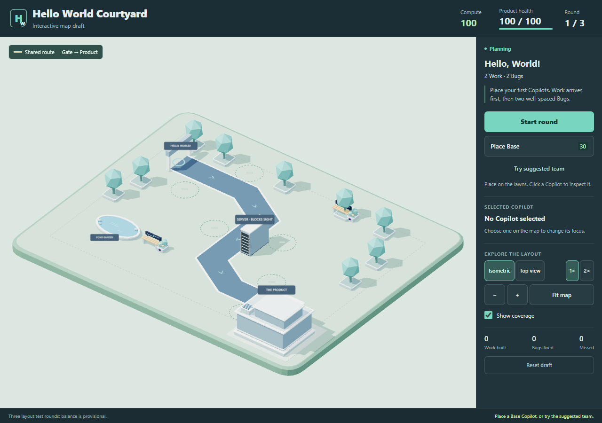

# Hello World Courtyard — interactive draft

**Direction selected by the user; layout and balance remain draft.** This is the first playable refinement of Hello World Courtyard, created on 30 September 2026. Source: `prototypes/hello-world-courtyard`.

## Experience and spatial structure

A welcoming campus frames one shared route from the Hello World gate to the Product studio. The open S makes the whole journey visible, with an early lawn for first Work, a central lawn beside the Server and a final approach for recovery. The pond and benches give the scene identity while staying outside the route.

Placement is free within valid space. Six numbered circles offer starting positions without imposing sockets. Selection and placement previews show effective Area coverage; the dashed outer ring shows nominal range, while the filled area is cut by the Server's actual sight obstruction.

The Product uses the delivered Campus Lab as a temporary proxy. A small feature module appears after a successful draft. The gate and Server are scene proxies that can become purpose-built assets once their shape and scale are agreed.

## Geometry refined in the prototype

| Item | Draft value | Design purpose |
| --- | --- | --- |
| Route | (-15,-8) → (-5,-8) → (0,-5) → (0,5) → (5,8) → (14,8) | Preserve the selected open S and clear start/destination. |
| Route length / travel | 40.66 units / 25.4 seconds at 1.6 units/s | Give time to read a moving Work item. |
| Road width | 3.2 units | Keep Work, Bugs and direction arrows readable. |
| Server footprint | x1.8–3.2, z-1.8–1.8; 1.4 × 3.6 units | Keep the route clear while cutting coverage from the outer middle lawn. |
| Tower range | 5 units | Create local stretches rather than full-route coverage. |
| Copilot footprint radius | 1.45 units in this draft | Reconcile placement with the delivered character scale. This is not an accepted change to the production 0.4 baseline. |
| Buildable boundary | x±18, z±13, with footprint containment | Keep placements on the courtyard. |
| Scenery exclusions | Product, pond, two benches and trees | Prevent placements inside visible scenery; these do not block sight. |

The actual 3D scene resolves the concept's scale uncertainty: large Copilots need meaningful spacing. The final footprint decision should be made alongside character scale and touch readability.

## Three short layout tests

| Round | Traffic | Intended observation |
| --- | --- | --- |
| Hello, World! | 2 Work, then 2 separated Bugs | First placement, Work progress, payout and defensive action. |
| A little multitasking | 3 Work and 2 Bugs, overlapping | Auto/Build/Defend choices and reinvestment. |
| Around the Server | 3 Work and 3 Bugs | Compare coverage on either side of the Server and keep a recovery position. |

Start with 100 Compute and 100 Product health. A Base costs 30; a Developer or Tester Persona costs another 20 and is permanent. Work pays 12 Compute and up to 4 healing; Bugs pay 8 and leak for 16 damage. Tester adds a non-stacking 10% slow and +1 completion reward in its aura. These values are deliberately provisional.

The native simulation governs placement, targeting, action timing, upgrades, payout, damage, movement and outcomes. The renderer follows snapshots and events; Work checkboxes and bars reflect actual remaining Work rather than route travel.

## What the first tests establish

Real browser input clears all three rounds with either three suggested Bases or Developer at (-11,-4) plus Tester at (-3.5,0). The specialist team finishes 8 Work, resolves 7 Bugs, misses none and retains full health. Native checks also show that an empty team loses by round three; Build-only leaves Bugs unresolved, and Defend-only misses Work.

The Server correctly blocks an in-range line from (4.6,-2.6) to (0.3,-0.5) while leaving a nearby line to (0,-4) clear. Desktop and phone controls work, including pause, touch zoom, top view and retry. Detailed evidence is beside the prototype.

This establishes a forgiving opening and functioning spatial rules. It does **not** establish final difficulty: an early specialist team currently resolves everything before the Server becomes necessary. Later tuning should make the middle and final stretches useful without forcing one exact opening.

## Decisions for the next review

1. **Scale and placement:** keep the full-size characters with this footprint, or reduce character scale and revisit the logical footprint.
2. **Server lesson:** decide how much sight obstruction the first map should teach; compare the two middle lawns in top view.
3. **Pacing:** turn these short tests into the full onboarding sequence only after the spatial layout feels right.
4. **Art production:** define the welcome gate, Server and Product growth kit after their dimensions and silhouettes settle.

The selected direction remains compatible with the existing Level 1 plan. Ambiguous Requirement, Technical Debt Sprint, Production Incident and Analyst unlock are outside this geometry draft.
